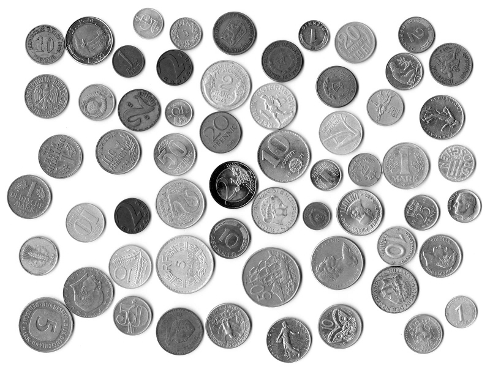

# Gradient Map and Hough Transform


## Compilation

compile code:

```
make
```


## Execution

run gradient map:

``` 
make grad               # option 1 (loads file in_grad.txt as input)
./gradient_map          # option 2 (here you can use the image coins.pgm as input)
```

run hough transform (using the generated gradient map):

```
make hough              # option 1 (loads file in_hough.txt as input)
./hough_transform       # option 2 (here you should use the generated gradient map as input)
```

## Results

